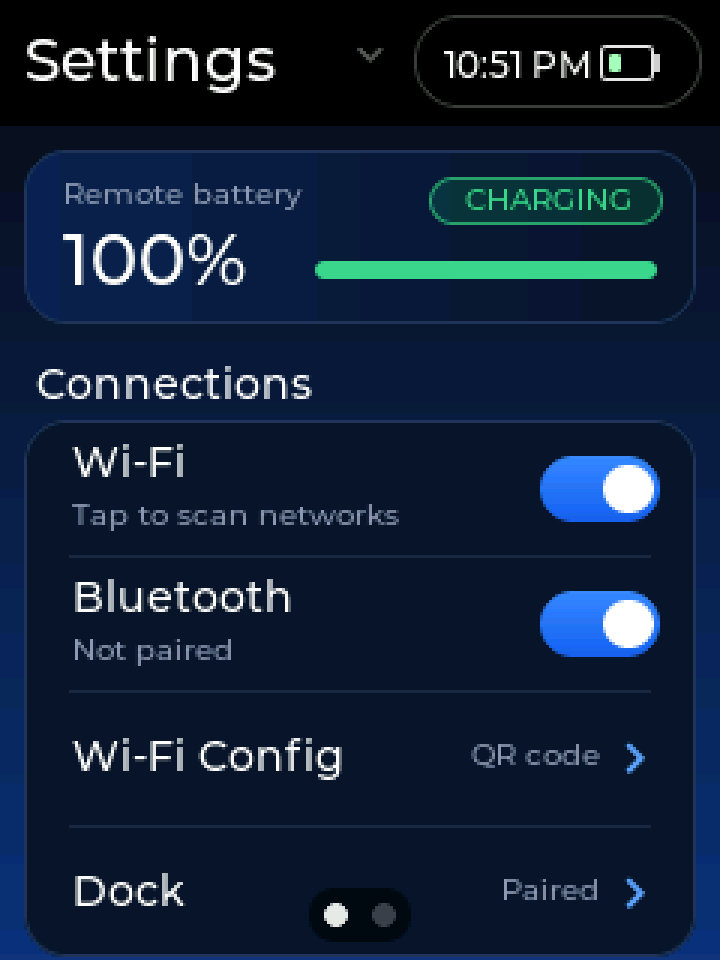
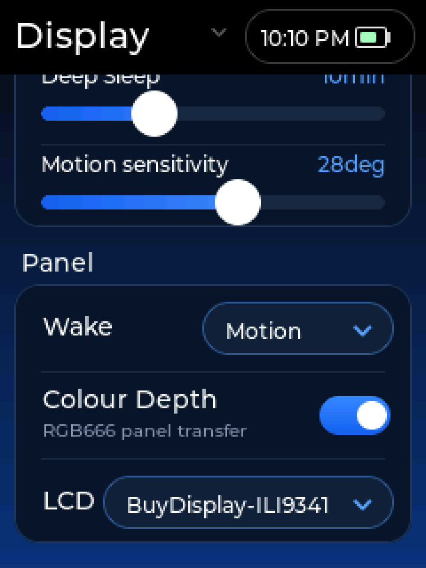
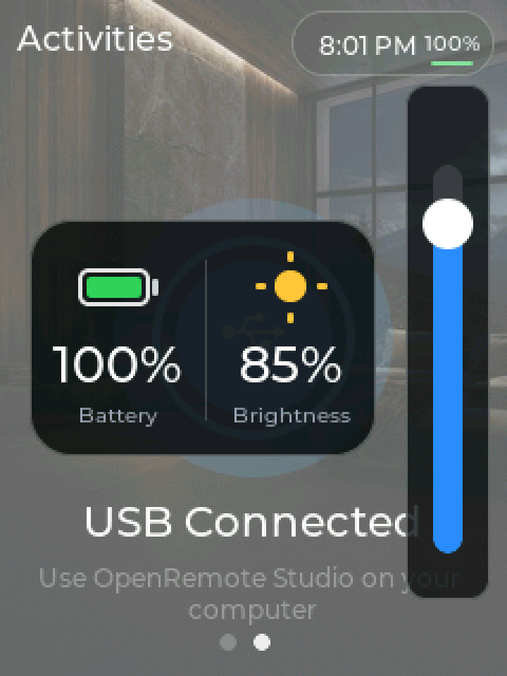
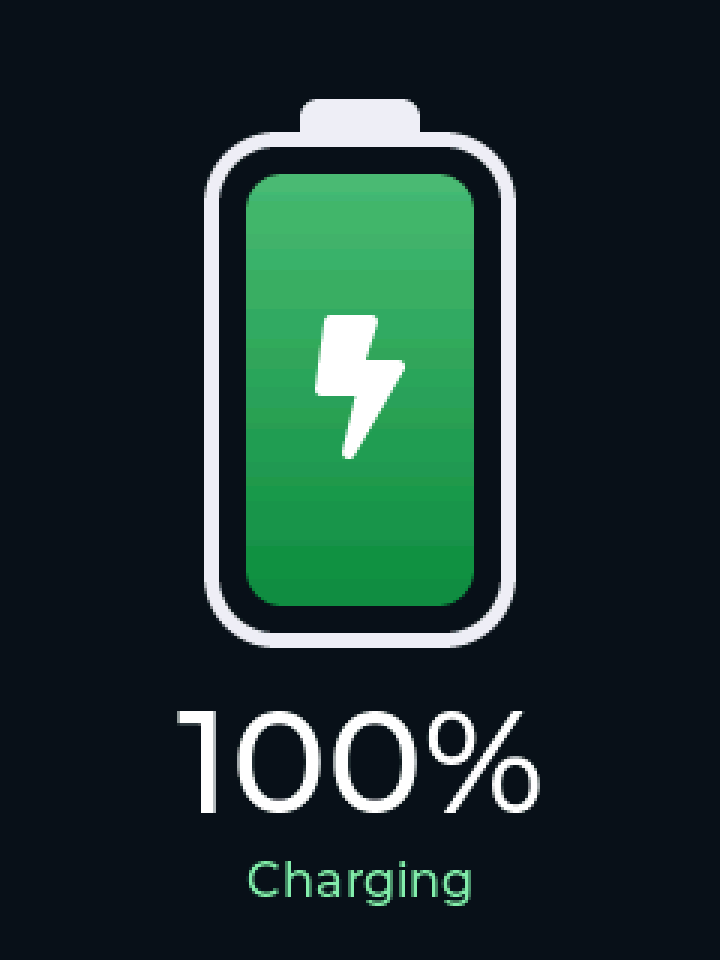
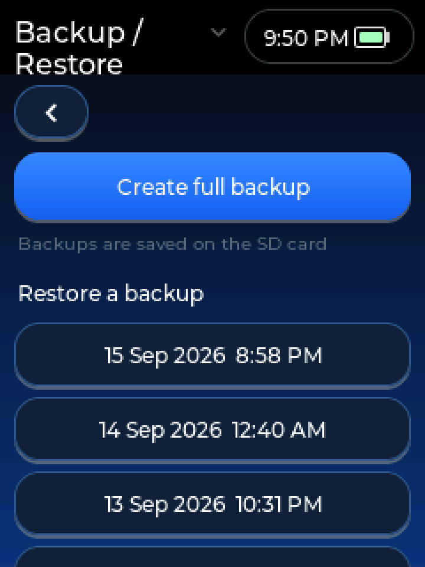
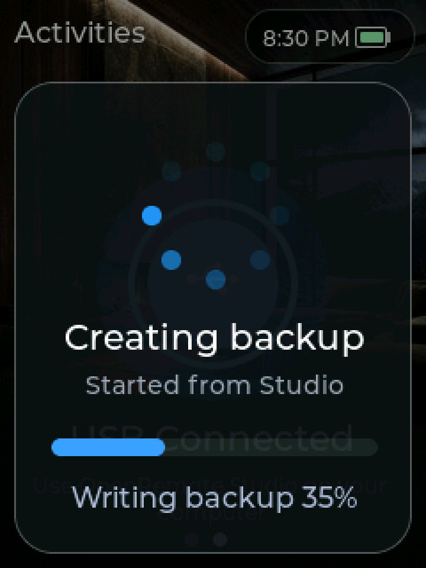
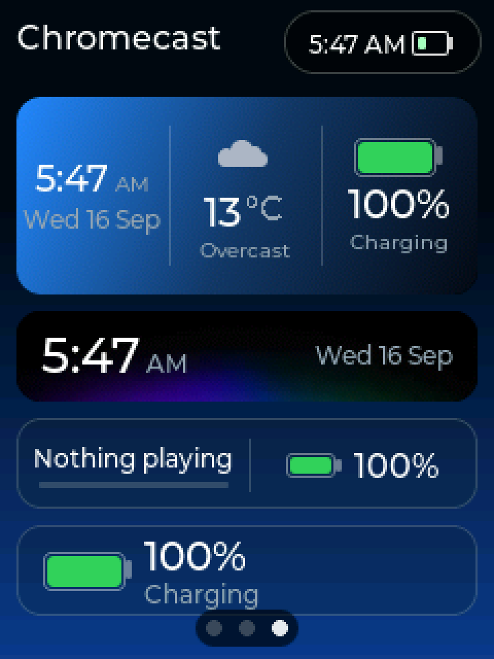
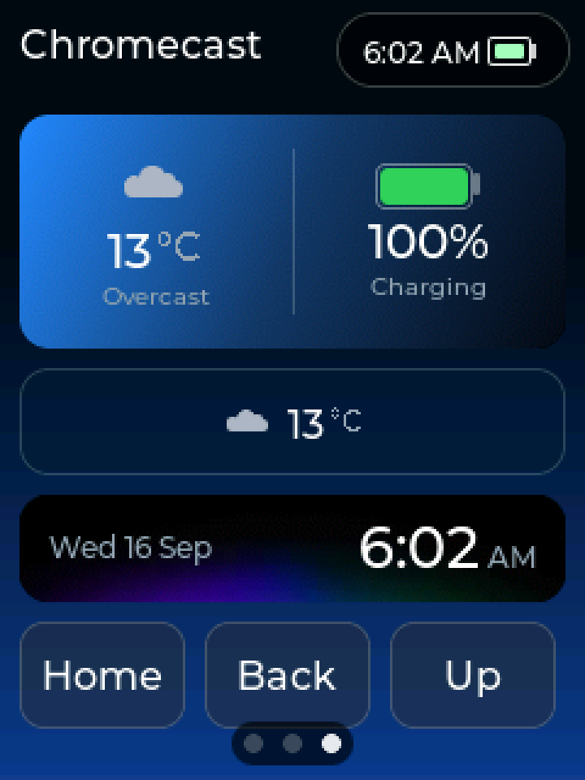
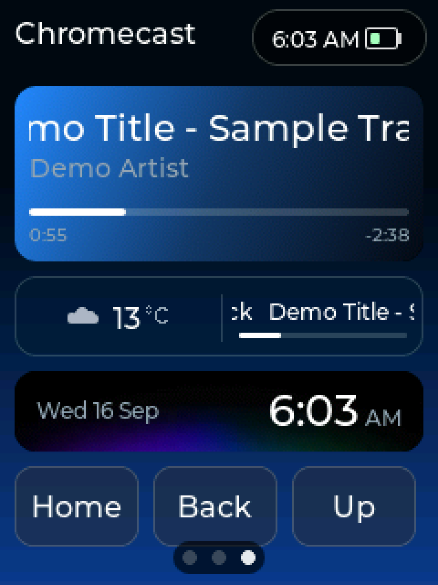
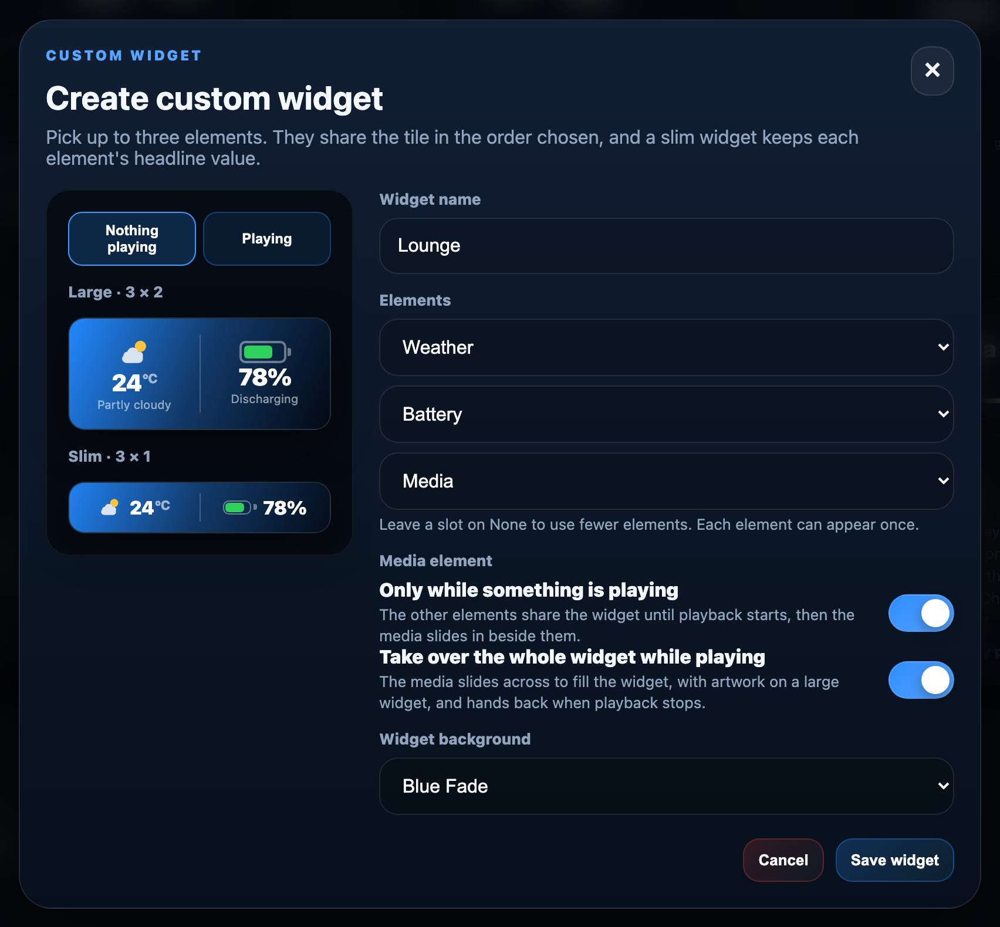

  

  ### Build your remote. Keep it local.

  A universal remote you own outright — no cloud, no accounts, no app store.
  Design it on your computer, configure it from your phone, and control
  everything in the room from the remote itself.

  <a href="#download">Download</a> ·
  <a href="#the-software">The software</a> ·
  <a href="#smart-home">Smart home</a> ·
  <a href="https://github.com/LORDSn1per/OpenRemote-Hardware">Hardware</a> ·
  <a href="#how-it-fits-together">How it fits together</a>

---

## You never have to write code

Everything is done through **OpenRemote Studio** on your computer or
**WebConfig** in a browser. Adding devices, building activities, designing
screens, changing icons and themes, and installing new firmware are all
point-and-click. The source in this repository is here because the project is
open, not because you are expected to compile it.

---

## Download

Every link below always fetches the **newest build** — the filenames never
change, so they are safe to bookmark.

### Get started — install this first

| | Download |
|---|---|
| **macOS** — Intel and Apple Silicon | [**OpenRemote Studio for macOS**](https://github.com/LORDSn1per/OpenRemote-Firmware/releases/latest/download/OpenRemote-Studio-2.85-macOS.zip) |
| **Windows** — 10 and 11 | [**OpenRemote Studio for Windows**](https://github.com/LORDSn1per/OpenRemote-Firmware/releases/latest/download/OpenRemote-Studio-2.85-Windows.zip) |
| **Linux** — x86_64 | [**OpenRemote Studio for Linux**](https://github.com/LORDSn1per/OpenRemote-Firmware/releases/latest/download/OpenRemote-Studio-2.85-Linux.AppImage) |

> On Windows, unzip the **whole folder** and run the `.exe` from inside it — the
> app and runtime folders must stay beside it.

### Firmware and configurator

Studio installs these for you, so you only need them for a manual update.

| | Download |
|---|---|
| Remote firmware — ESP32-S3 | [**OpenRemote-Remote-Firmware-5.70.bin**](https://github.com/LORDSn1per/OpenRemote-Firmware/releases/latest/download/OpenRemote-Remote-Firmware-5.70.bin) |
| Dock firmware — ESP32-C3 | [**OpenRemote-Dock-Firmware-1.84.bin**](https://github.com/LORDSn1per/OpenRemote-Firmware/releases/latest/download/OpenRemote-Dock-Firmware-1.84.bin) |
| WebConfig — browser configurator | [**OpenRemote-WebConfig-3.38.html**](https://github.com/LORDSn1per/OpenRemote-Firmware/releases/latest/download/OpenRemote-WebConfig-3.38.html) |

**[See all downloads and version numbers →](https://github.com/LORDSn1per/OpenRemote-Firmware/releases/latest)**

---

## The software

### OpenRemote Studio — the desktop toolkit

Sets up a new remote from a blank board, builds the infrared database, and
repairs a remote that will not start. This is the tool that turns a bare
circuit board into a working remote.

[Read more →](studio/README.md)

### WebConfig — configure from any screen

Served by the remote itself over your Wi-Fi. Open its address on a laptop or
phone and design screens, build activities and macros, assign the physical
buttons, and change icons and themes — with the remote updating live as you
work. Nothing to install, and it works on any device with a browser.

**The whole infrared database lives on the remote's own SD card.** Copy it
across from the browser, then search all 14,000-plus devices straight from
WebConfig — no computer and no Studio needed. The searching happens on the
remote and the matching devices come straight from its SD card, with no Wi-Fi
needed, so a brand with hundreds of models is a list you scroll, not a download. Click any command to
fire the real infrared through the remote or the dock, so you can confirm a
code set before you keep it.

Also in the browser: a file manager for the SD card, complete backups written
by the remote itself and restored the same way, and a one-file export for any
single device — infrared, RF433, Homebridge, MQTT or Bluetooth — that can be
imported into another remote.

[Read more →](webconfig/README.md)

### Remote firmware — on-device control

Runs on the remote: a colour touchscreen, physical buttons, infrared, Bluetooth
for Android TV and Chromecast — including voice search through the built-in
microphone — plus Wi-Fi for Home Assistant, MQTT and Homebridge.

#### On the screen

<table>
  <tr>
    <td align="center" width="33%"> <b>Settings</b> — battery at a glance, then every connection one tap away</td>
    <td align="center" width="33%"> <b>Display</b> — large slider knobs that are easy to grab</td>
    <td align="center" width="33%"> <b>Brightness panel</b> — tap the status pill from any page</td>
  </tr>
  <tr>
    <td align="center"> <b>Charging</b> — shown for a few seconds when you plug in</td>
    <td align="center"> <b>Backup / Restore</b> — full backups saved to the SD card, restored with one tap</td>
    <td align="center"> <b>Progress</b> — shown on the remote, whether started from Studio, WebConfig or the remote itself</td>
  </tr>
</table>

#### Widgets

Live tiles that redraw themselves from real data: **Weather**, **Battery** and
**Media** from the library, or widgets you build yourself. Every widget comes in
two sizes — **large**, three columns and two rows, or **slim**, a single row the
height of a button. A slim widget keeps each element's headline value and leaves
out media artwork. Tap any widget to open it full screen.

**Custom widgets.** Combine up to three elements — **time and date**,
**weather**, **battery** and **media** — into one widget, give it a name and a
Widget Wallpaper, and place it large or slim. The time element can put the date
before or after the time. A media element that shares a widget can:

- **show only while something is playing** — the other elements fill the widget
  until playback starts, then the media slides in beside them;
- **take over the whole widget while playing** — the media slides across to show
  the title, progress and artwork, and hands back when playback stops.

**Auto hiding.** A media-only widget can take up no rows at all while nothing is
playing. When playback starts it grows into place from its top edge and smoothly
pushes everything below it down by its one or two rows; when playback stops the
page closes up again. The screen designer always shows it at full size.

With a dock paired, the weather is fetched and kept by the dock, and the remote
only asks for it while a weather widget is on screen — so the remote's own Wi-Fi
stays off.

<table>
  <tr>
    <td align="center" width="33%"> <b>Custom widgets</b> — time, weather and battery, large and slim</td>
    <td align="center" width="33%"> <b>Nothing playing</b> — weather and battery fill the widget</td>
    <td align="center" width="33%"> <b>Playing</b> — media slides in and takes the widget over</td>
  </tr>
</table>

<b>Built in WebConfig</b> — pick the elements, name and wallpaper, and preview <i>Nothing playing</i> and <i>Playing</i> before you save.

#### Button shortcuts

Two button combinations work from anywhere, whatever page the remote is showing
and whatever the buttons are bound to. Both also fire the buttons' own normal
commands, so use keys whose commands are harmless to send.

| Hold | Does |
|---|---|
| **Stop + Forward** together | Jumps straight into Settings and takes touch out of the way, so the D-pad and OK navigate the menus. Press Back from the Settings home to leave again. |
| **Red + Blue** for 7 seconds | Restores the safe Adafruit display settings and reboots immediately, with no confirmation. |

The Red + Blue reset exists for a screen you cannot read — the wrong panel
driver, inverted colours, a bus clock the fitted panel will not take. A
confirmation dialog on an unreadable screen would be no help, so there isn't
one; holding two specific keys for seven seconds is the confirmation. It restores
the Adafruit module, colour inversion off, the Arduino_GFX driver, a 20 MHz LCD
clock, double buffering and default pressure — the combination that works on
every supported panel. Nothing else is touched: your activities, devices, Wi-Fi
and pairings are all left alone.

If the screen is readable, **Settings > Display > LCD** is the better route. It
sets a whole matched configuration for Adafruit, BuyDisplay-ILI9341 or
BuyDisplay-ST7789V and asks before restarting, and cancelling changes nothing.

[Read more →](remote/README.md)

### Dock firmware — reach the rooms the remote cannot

Mains powered, sits with your equipment, and relays commands from the remote
over its own radio link. It fires infrared into a closed cabinet or a second
room, and sends **RF433** to gates, garage doors and sockets by learning the
signal from your existing remote.

It can also carry your **Home Assistant**, **MQTT** and **Homebridge**
commands, and they arrive noticeably faster. Because it is mains powered it
stays joined to your Wi-Fi permanently, so a command goes out on an
already-open connection — where the remote, running on a battery, must wake its
radio and join the network first.

That permanent connection buys something the remote cannot do alone: the dock
holds a Home Assistant WebSocket and an MQTT subscription open, so a tile
showing whether a light is on stays right even while the remote sleeps. All of
it is optional and off until you turn it on.

It also keeps the **time and weather** for the remote. The dock syncs the clock
and fetches the forecast on its always-on connection, holding only the newest
reading, and the remote asks for it only when it is needed — a weather widget on
screen, or its daily clock sync — so the remote's Wi-Fi stays off. The status
LED's **brightness** is set from WebConfig.

Update it whichever way suits: **wirelessly from WebConfig**, or **over USB
from Studio**.

[Read more →](dock/README.md)

---

## Smart home

Three integrations, each answering a different question. Turn on whichever you
use — they are independent, and none of them requires the others.

### Home Assistant

OpenRemote reads your entity list straight from the server, so you tick the
lights, switches and scenes you want rather than typing anything. A light
arrives already knowing what it is and how to turn it on.

Tiles show **live state** — a light tile reads *on* or *off* from the server
rather than assuming your last press worked, and a cover reads *open*, because
Home Assistant does not use the same word for every kind of thing.

You need a **long-lived access token**, created at the bottom of your Home
Assistant profile page. It is stored on the remote itself and never appears in
a backup file.

### MQTT

A broker is a message noticeboard on your network. OpenRemote publishes a topic
and a payload, and anything listening reacts. It reaches hardware no hub knows
about — a bare ESP32 in the shed, a Tasmota plug, an MQTT-native doorbell — and
needs no hub at all.

Give a button a **state topic** as well and its tile shows the last value the
broker reported, so a garage button can read *OPEN*.

### Homebridge

Import accessories from a Homebridge server on your network, the same way as
Home Assistant entities. Useful if Homebridge is already your hub.

### With or without the dock

Every one of these works without a dock. Each has a switch deciding whether the
**dock** or the **remote** does the talking, and the settings page tells you
what the choice costs in your particular setup:

| | Through the dock | From the remote |
|---|---|---|
| Sending a command | Immediate | A few seconds to wake Wi-Fi |
| Live tile state | Arrives the moment it changes, even while the remote sleeps | Polled every few seconds, only while the screen is awake |
| Battery | Costs nothing | Costs Wi-Fi time |

---

## Hardware

Boards, schematics, cases and build instructions live in a separate repository:

### [**OpenRemote Hardware →**](https://github.com/LORDSn1per/OpenRemote-Hardware)

---

## How it fits together

    Studio (computer) ──USB──►  Remote  ◄──Wi-Fi──► WebConfig (browser)
                                   │
                                   ├── infrared ──► your equipment
                                   ├── Bluetooth ─► Android TV / Chromecast
                                   ├── Wi-Fi ─────► Home Assistant / MQTT / Homebridge
                                   └── radio ─────► Dock ──► infrared + RF433
                                                      │
                                                      └──► the same smart home,
                                                           faster, and always on

**Studio** does the jobs needing a cable: first setup, recovery, and the
infrared database. **WebConfig** does everything else, wirelessly. The
**dock** extends the remote's reach without extending your arm.

---

## For developers

| Component | Version | Source |
|---|---|---|
| Remote firmware — ESP32-S3 | 5.70 | [`remote/`](remote/) |
| Dock firmware — ESP32-C3 | 1.84 | [`dock/`](dock/) |
| WebConfig | 3.38 | [`webconfig/`](webconfig/) |
| OpenRemote Studio | 2.85 | [`studio/`](studio/) |

    remote/       ESP32-S3 remote firmware (PlatformIO)
    dock/         ESP32-C3 dock firmware (PlatformIO)
    webconfig/    single-file HTML configurator
    studio/       desktop app sources (Mac, Windows, Linux)
    sd-card/      template of the remote's SD card
    tools/ docs/  build helpers and notes
    releases/     archived builds, one per version (not in git)

Both firmwares build with [PlatformIO](https://platformio.org/):

    cd remote && pio run -t upload
    cd dock/firmware && pio run -t upload

The remote and dock share an ESP-NOW wire format whose every struct is pinned
by `static_assert` in **both** firmwares, which is why they live in one
repository — a field added to one and not the other fails the build instead of
letting the two misread each other on air.

---

**Open. Powerful. Yours.**

A fork of [OMOTE](https://github.com/OMOTE-Community/OMOTE-Firmware), grown
into its own firmware, configurator and desktop toolkit.

