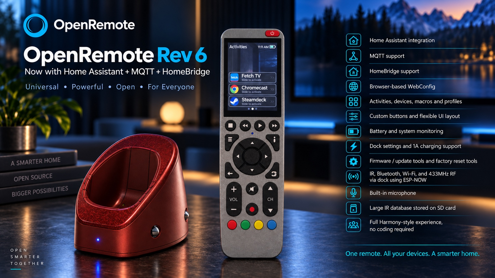
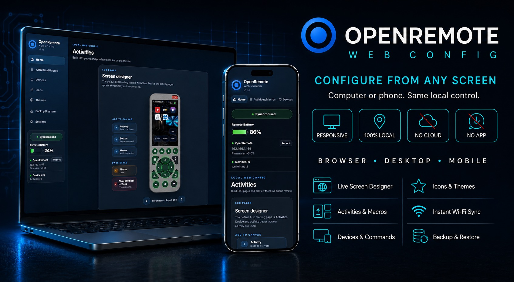
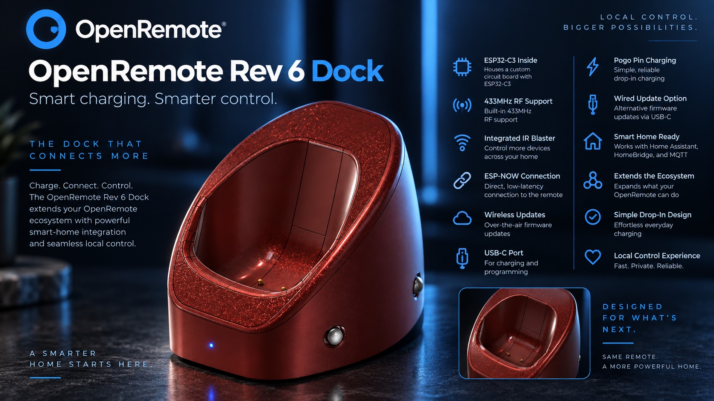

  

  ### Build your remote. Keep it local.

  A universal remote you own outright — no cloud, no accounts, no app store.
  Design it on your computer, configure it from your phone, and control
  everything in the room from the remote itself.

  <a href="#download">Download</a> ·
  <a href="#the-software">The software</a> ·
  <a href="#smart-home">Smart home</a> ·
  <a href="https://github.com/LORDSn1per/OpenRemote-Hardware">Hardware</a> ·
  <a href="#how-it-fits-together">How it fits together</a>

---

## You never have to write code

Everything is done through **OpenRemote Studio** on your computer or
**WebConfig** in a browser. Adding devices, building activities, designing
screens, changing icons and themes, and installing new firmware are all
point-and-click. The source in this repository is here because the project is
open, not because you are expected to compile it.

---

## Download

Every link below always fetches the **newest build** — the filenames never
change, so they are safe to bookmark.

### Get started — install this first

| | Download |
|---|---|
| **macOS** — Intel and Apple Silicon | [**OpenRemote Studio for macOS**](https://github.com/LORDSn1per/OpenRemote-Firmware/releases/latest/download/OpenRemote-Studio-2.79-macOS.zip) |
| **Windows** — 10 and 11 | [**OpenRemote Studio for Windows**](https://github.com/LORDSn1per/OpenRemote-Firmware/releases/latest/download/OpenRemote-Studio-2.79-Windows.zip) |
| **Linux** — x86_64 | [**OpenRemote Studio for Linux**](https://github.com/LORDSn1per/OpenRemote-Firmware/releases/latest/download/OpenRemote-Studio-2.79-Linux.AppImage) |

> On Windows, unzip the **whole folder** and run the `.exe` from inside it — the
> app and runtime folders must stay beside it.

### Firmware and configurator

Studio installs these for you, so you only need them for a manual update.

| | Download |
|---|---|
| Remote firmware — ESP32-S3 | [**OpenRemote-Remote-Firmware-4.48.bin**](https://github.com/LORDSn1per/OpenRemote-Firmware/releases/latest/download/OpenRemote-Remote-Firmware-4.48.bin) |
| Dock firmware — ESP32-C3 | [**OpenRemote-Dock-Firmware-1.61.bin**](https://github.com/LORDSn1per/OpenRemote-Firmware/releases/latest/download/OpenRemote-Dock-Firmware-1.61.bin) |
| WebConfig — browser configurator | [**OpenRemote-WebConfig-2.75.html**](https://github.com/LORDSn1per/OpenRemote-Firmware/releases/latest/download/OpenRemote-WebConfig-2.75.html) |

**[See all downloads and version numbers →](https://github.com/LORDSn1per/OpenRemote-Firmware/releases/latest)**

---

## The software

### OpenRemote Studio — the desktop toolkit

Sets up a new remote from a blank board, holds a 100 MB infrared database you
can search for your equipment, and repairs a remote that will not start. This
is the tool that turns a bare circuit board into a working remote.

[Read more →](studio/README.md)

### WebConfig — configure from any screen

Served by the remote itself over your Wi-Fi. Open its address on a laptop or
phone and design screens, build activities and macros, assign the physical
buttons, and change icons and themes — with the remote updating live as you
work. Nothing to install, and it works on any device with a browser.

[Read more →](webconfig/README.md)

### Remote firmware — on-device control

Runs on the remote: a colour touchscreen, physical buttons, infrared, Bluetooth
for Android TV and Chromecast — including voice search through the built-in
microphone — plus Wi-Fi for Home Assistant, MQTT and Homebridge.

[Read more →](remote/README.md)

### Dock firmware — reach the rooms the remote cannot

Mains powered, sits with your equipment, and relays commands from the remote
over its own radio link. It fires infrared into a closed cabinet or a second
room, and sends **RF433** to gates, garage doors and sockets by learning the
signal from your existing remote.

It can also carry your **Home Assistant**, **MQTT** and **Homebridge**
commands, and they arrive noticeably faster. Because it is mains powered it
stays joined to your Wi-Fi permanently, so a command goes out on an
already-open connection — where the remote, running on a battery, must wake its
radio and join the network first.

That permanent connection buys something the remote cannot do alone: the dock
holds a Home Assistant WebSocket and an MQTT subscription open, so a tile
showing whether a light is on stays right even while the remote sleeps. All of
it is optional and off until you turn it on.

Update it whichever way suits: **wirelessly from WebConfig**, or **over USB
from Studio**.

[Read more →](dock/README.md)

---

## Smart home

Three integrations, each answering a different question. Turn on whichever you
use — they are independent, and none of them requires the others.

### Home Assistant

OpenRemote reads your entity list straight from the server, so you tick the
lights, switches and scenes you want rather than typing anything. A light
arrives already knowing what it is and how to turn it on.

Tiles show **live state** — a light tile reads *on* or *off* from the server
rather than assuming your last press worked, and a cover reads *open*, because
Home Assistant does not use the same word for every kind of thing.

You need a **long-lived access token**, created at the bottom of your Home
Assistant profile page. It is stored on the remote itself and never appears in
a backup file.

### MQTT

A broker is a message noticeboard on your network. OpenRemote publishes a topic
and a payload, and anything listening reacts. It reaches hardware no hub knows
about — a bare ESP32 in the shed, a Tasmota plug, an MQTT-native doorbell — and
needs no hub at all.

Give a button a **state topic** as well and its tile shows the last value the
broker reported, so a garage button can read *OPEN*.

### Homebridge

Import accessories from a Homebridge server on your network, the same way as
Home Assistant entities. Useful if Homebridge is already your hub.

### With or without the dock

Every one of these works without a dock. Each has a switch deciding whether the
**dock** or the **remote** does the talking, and the settings page tells you
what the choice costs in your particular setup:

| | Through the dock | From the remote |
|---|---|---|
| Sending a command | Immediate | A few seconds to wake Wi-Fi |
| Live tile state | Arrives the moment it changes, even while the remote sleeps | Polled every few seconds, only while the screen is awake |
| Battery | Costs nothing | Costs Wi-Fi time |

---

## Hardware

Boards, schematics, cases and build instructions live in a separate repository:

### [**OpenRemote Hardware →**](https://github.com/LORDSn1per/OpenRemote-Hardware)

---

## How it fits together

    Studio (computer) ──USB──►  Remote  ◄──Wi-Fi──► WebConfig (browser)
                                   │
                                   ├── infrared ──► your equipment
                                   ├── Bluetooth ─► Android TV / Chromecast
                                   ├── Wi-Fi ─────► Home Assistant / MQTT / Homebridge
                                   └── radio ─────► Dock ──► infrared + RF433
                                                      │
                                                      └──► the same smart home,
                                                           faster, and always on

**Studio** does the jobs needing a cable: first setup, recovery, and the
infrared database. **WebConfig** does everything else, wirelessly. The
**dock** extends the remote's reach without extending your arm.

---

## For developers

| Component | Version | Source |
|---|---|---|
| Remote firmware — ESP32-S3 | 4.02 | [`remote/`](remote/) |
| Dock firmware — ESP32-C3 | 1.30 | [`dock/`](dock/) |
| WebConfig | 2.56 | [`webconfig/`](webconfig/) |
| OpenRemote Studio | 2.76 | [`studio/`](studio/) |

    remote/       ESP32-S3 remote firmware (PlatformIO)
    dock/         ESP32-C3 dock firmware (PlatformIO)
    webconfig/    single-file HTML configurator
    studio/       desktop app sources (Mac, Windows, Linux)
    sd-card/      template of the remote's SD card
    tools/ docs/  build helpers and notes
    releases/     archived builds, one per version (not in git)

Both firmwares build with [PlatformIO](https://platformio.org/):

    cd remote && pio run -t upload
    cd dock/firmware && pio run -t upload

The remote and dock share an ESP-NOW wire format whose every struct is pinned
by `static_assert` in **both** firmwares, which is why they live in one
repository — a field added to one and not the other fails the build instead of
letting the two misread each other on air.

---

**Open. Powerful. Yours.**

A fork of [OMOTE](https://github.com/OMOTE-Community/OMOTE-Firmware), grown
into its own firmware, configurator and desktop toolkit.

