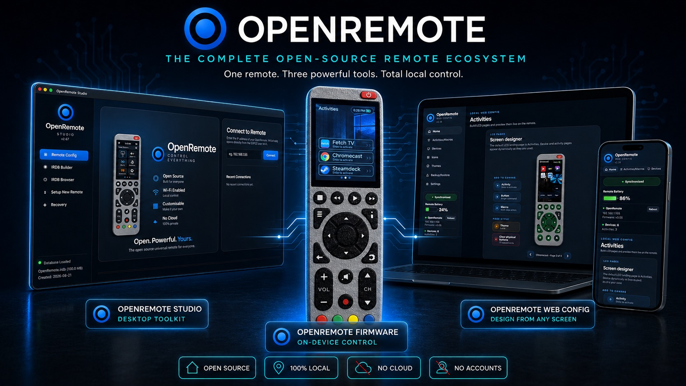
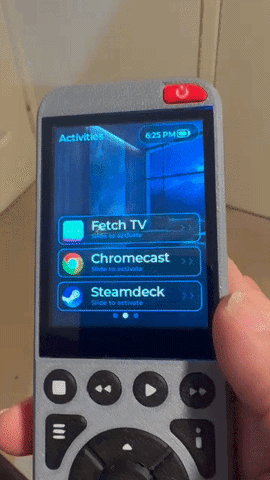
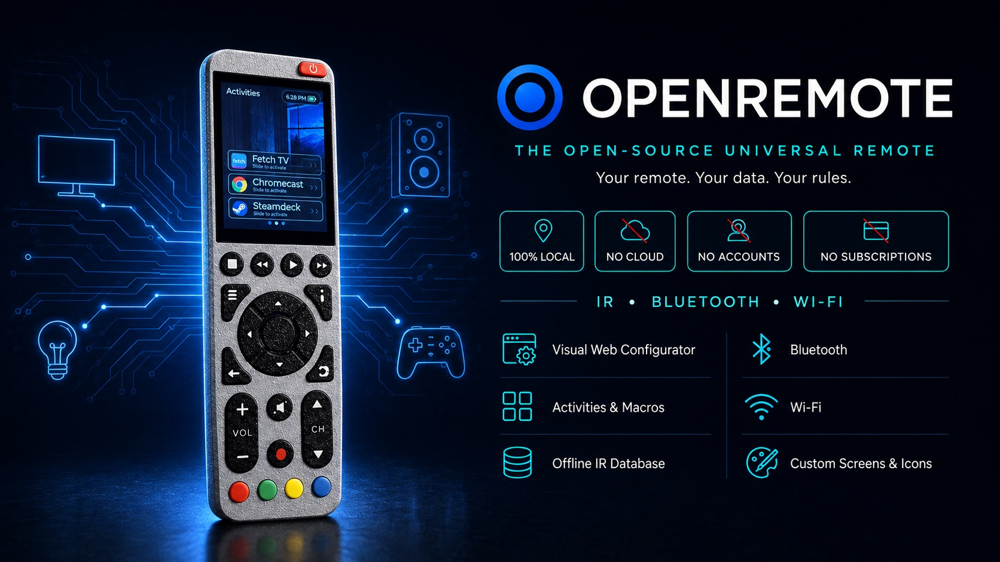

<p align="center">
  
</p>

<h1 align="center">OpenRemote</h1>

<p align="center">
  <strong>The universal remote that belongs to you.</strong><br>
  One remote. Three powerful tools. Total local control.
</p>

<p align="center">
  
  
  
  
  
</p>

---

## Everything the Harmony was. Nothing it took away.

If you owned a Logitech Harmony, you know how it ended. Logitech discontinued the
hardware, and the whole experience depended on their servers — the setup software,
the device database, the account you had to make just to program a remote sitting
on your own coffee table.

**OpenRemote is what comes next, and it improves on the Harmony in the ways that
actually matter:**

|  | Logitech Harmony | OpenRemote |
|---|---|---|
| **Cloud dependency** | Required for setup | **None — 100% local** |
| **Account required** | Yes | **No** |
| **If the company disappears** | Remote becomes a paperweight | **Nothing changes. It's yours.** |
| **Configuration** | Desktop app tied to their service | **Any browser, on the remote itself** |
| **Screen** | Small mono / basic colour | **240×320 colour LCD, custom themes** |
| **Voice search** | No | **Yes — built-in mic over Bluetooth** |
| **Smart home** | Cloud-linked hubs | **Homebridge, on your own network** |
| **Source code** | Closed | **Fully open — this repo** |
| **Cost to keep using it** | Subscription era pricing | **Free, forever** |

Your remote never phones home, because there's no home to phone. Everything —
your devices, your activities, your layouts — lives on the SD card in your hand.

<p align="center">
  
</p>

<p align="center">
  <sub><em>Slide to activate — activities on the real hardware.</em></sub>
</p>

---

## No programming required. Ever.

This is the part that matters most, and it's what makes OpenRemote different from
most open-source remote projects — **including the one it's built on.**

OpenRemote is a fork of the excellent [OMOTE](https://github.com/OMOTE-Community)
project, which provides the open hardware design this runs on. But stock OMOTE is
a *developer's* firmware: adding a device, changing a button, or tweaking a layout
means editing C++ source and reflashing the remote.

**OpenRemote replaces that entirely.** Every part of your remote is configured
visually — point, click, done:

- ✅ **Add a TV** — search a built-in database of thousands of devices
- ✅ **Design your screens** — drag buttons onto a live canvas and see it on the remote
- ✅ **Build activities** — "Watch TV" turns on three devices in the right order
- ✅ **Custom icons and themes** — upload your own artwork
- ✅ **Remap physical buttons** — per device, per activity
- ❌ **Write code** — never

No IDE. No compiler. No terminal. If you can use a web page, you can build your
own universal remote.

---

## Features

### 🎛️ Control anything
- **Infrared (IR)** — TVs, amplifiers, Blu-ray, projectors, anything with an IR receiver
- **Bluetooth LE** — control a Chromecast / Android TV as a native remote, no IR line-of-sight needed
- **Wi-Fi** — network control on your local network
- **Homebridge** — trigger lights, switches and scenes on your own smart home, locally

### 🎤 Voice search over Bluetooth
Hold the mic button and speak straight into your Chromecast or Android TV.
Audio streams over Bluetooth LE using the native Android TV Voice protocol — the
same way a genuine Google remote does it. No cloud, no third-party service.

### 🎨 A screen worth looking at
- **240×320 colour LCD** with custom wallpapers and themes
- **Activities** as full swipeable pages, not cramped button lists
- **Custom icons** — upload your own artwork per device or button
- **Adjustable gamma, saturation and brightness** to suit the panel

### 📚 Massive offline IR database
Build a searchable IR code database from four community sources — over 100,000
codes — and load it onto the remote's SD card. It works **completely offline**,
forever, with no lookup service to shut down.

### 🔄 Backup and restore, two ways
- **On the remote** — back up and restore straight from the LCD menu to the SD card
- **From WebConfig** — full backup/restore in the browser, including embedded icons and themes

Your entire configuration is a file you own. Copy it, archive it, move it to
another remote.

### 🕐 Set-and-forget conveniences
- **Network time sync (NTP)** — the clock is always right, syncing once a day
- **Motion wake** — lifts to life when you pick it up
- **Deep sleep power management** — tuned for real battery life
- **USB recovery** — a rescue path even if the remote's own web page is unreachable

---

## The three pieces

<table>
<tr>
<td width="33%" valign="top">

### 📟 Firmware
**On-device control**

Runs on the remote itself. IR, Bluetooth, Wi-Fi, the LCD interface, activities,
macros and sleep management.

*This folder.*

</td>
<td width="33%" valign="top">

### 🖥️ [Studio](studio/)
**Desktop toolkit**

Mac and Windows app. Builds the IR database, flashes firmware, prepares a new SD
card, and recovers a remote over USB.

[→ Studio](studio/)

</td>
<td width="33%" valign="top">

### 🌐 [WebConfig](webconfig/)
**Design from any screen**

Served by the remote itself. Configure everything from a browser on your phone or
computer. No app to install.

[→ WebConfig](webconfig/)

</td>
</tr>
</table>

---

<p align="center">
  
</p>

## Firmware

The ESP32-S3 firmware — a PlatformIO / Arduino project. This is what runs on the
remote: the LCD interface, IR and Bluetooth transmission, activities and macros,
Wi-Fi, Homebridge, voice capture, sleep management and the SD-card configuration
system.

### Building

```bash
platformio run
platformio run --target upload --upload-port /dev/cu.usbserial-XXXX
platformio device monitor -p /dev/cu.usbserial-XXXX
```

Or skip building entirely — grab a compiled `.bin` from
[Releases](../../releases) and flash it with **OpenRemote Studio**, no toolchain
needed.

### Version history

The changelog comment at the very top of `OpenRemote_1.0.ino` is the authoritative
history — every version documents the *reasoning*, not just the change.

---

## Hardware

The remote is built on the open **OMOTE Rev 5** hardware platform:

- **ESP32-S3** — 16 MB flash, 8 MB PSRAM
- **240×320 colour LCD** with capacitive touch
- **IR transmitter and receiver**
- **I²S microphone** for voice search
- **Accelerometer** for motion wake
- **microSD** for configuration, themes, icons and the IR database
- **USB-C** charging with battery fuel gauge

Hardware files: [OpenRemote-Hardware](https://github.com/LORDSn1per/OpenRemote-Hardware)

---

## Credits

Built on the open hardware platform created by the
[OMOTE Community](https://github.com/OMOTE-Community) — full credit to that
project for the design this runs on. OpenRemote is an independent fork with
substantial additions: the configuration system, Studio, WebConfig, Bluetooth
voice, Homebridge support, and the no-code workflow that ties it together.

---

<p align="center">
  <strong>Open. Powerful. Yours.</strong><br>
  <sub>No cloud · No accounts · No subscriptions · No compromises</sub>
</p>
