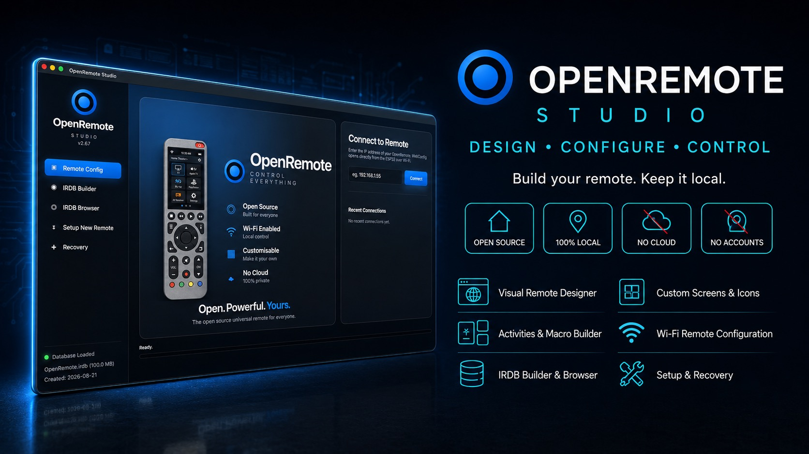

  

  ### The desktop toolkit

  Turns a bare circuit board into a working remote, finds the infrared codes
  for your equipment, and rescues a remote that will not start.

  <a href="#download">Download</a> ·
  <a href="#what-it-does">What it does</a> ·
  <a href="#setting-up-a-brand-new-remote">First-time setup</a> ·
  <a href="#recovery">Recovery</a>

---

## Download

No installation, no accounts, and nothing to compile. Always the newest build:

| Platform | Download |
|---|---|
| **macOS** — Intel and Apple Silicon | [**Download for macOS**](https://github.com/LORDSn1per/OpenRemote-Firmware/releases/latest/download/OpenRemote-Studio-2.78-macOS.zip) |
| **Windows** — 10 and 11, 64-bit | [**Download for Windows**](https://github.com/LORDSn1per/OpenRemote-Firmware/releases/latest/download/OpenRemote-Studio-2.78-Windows.zip) |
| **Linux** — x86_64 | [**Download for Linux**](https://github.com/LORDSn1per/OpenRemote-Firmware/releases/latest/download/OpenRemote-Studio-2.70-Linux.AppImage) |

**macOS** — unzip and drag to Applications. The build is universal, so it runs
on Apple Silicon and older Intel Macs alike.

**Windows** — unzip the **whole folder** and run `OpenRemote Studio.exe` from
inside it. The `app` and `runtime` folders must stay beside the `.exe`. Python
is bundled; you do not need to install it.

**Linux** — mark the AppImage executable (`chmod +x`) and run it.

Studio opens in your default browser but runs entirely on your own machine.
Nothing is sent anywhere.

---

## What it does

### Remote Config
Connect over USB or type your remote's Wi-Fi address. Studio reads what is on
the remote and lets you edit it: devices, activities, macros, screen layouts,
icons and themes.

### IRDB Builder & Browser
A searchable infrared database — around 100 MB of codes — so you can pick your
TV, amplifier or set-top box by make and model instead of teaching every button
by hand. Build your own database file, or browse the bundled one.

### Setup New Remote
Writes firmware, partition table and a complete SD card to a blank board in one
pass. This is the only step that genuinely needs a USB cable, and it is a
one-time job.

### New Dock
The same thing for a dock: flashes an ESP32-C3 and prepares it for pairing.
After the first flash, every later dock update goes over the air.

### Recovery
For a remote that will not boot or has lost its configuration:

- **Update Firmware** — installs a `.bin` over USB and **keeps every setting**:
  saved Wi-Fi, Bluetooth pairings, devices, activities and display options all
  survive. Use this rather than *Setup New Remote*, which deliberately erases
  everything.
- **Install WebConfig** — restores the browser configurator to the SD card.
- **Prepare SD Card** — rebuilds the folder structure a remote expects.
- **Load Backup** and **Load .IR File** — restore a saved configuration.
- **Restore Factory Settings** — start over.

---

## Setting up a brand-new remote

1. Install Studio and open it.
2. Plug the remote in over USB.
3. **Setup New Remote**, and follow the steps.
4. When it restarts, join it to your Wi-Fi and switch to
   [WebConfig](../webconfig/README.md) for everyday changes.

---

## Recovery

Two paths that look similar and are not:

| | Keeps your settings | Use it for |
|---|---|---|
| **Recovery → Update Firmware** | **Yes** | Updating a working remote |
| **Setup New Remote** | **No** — erases everything | A blank or unrecoverable board |

Updating writes only the application, leaving the settings area of flash
untouched. Setting up a new remote writes from the very start of flash, which
necessarily passes straight through everything you have saved.

---

## For developers

Sources live here; built applications are attached to
[Releases](https://github.com/LORDSn1per/OpenRemote-Firmware/releases/latest)
rather than committed, because each macOS bundle is about 85 MB.

    studio/Linux/app/openremote_studio.py   the application (canonical copy)
    studio/Linux/app/studio.html            its interface
    studio/Windows/                         Windows launcher, app and runtime
    studio/Mac/BUILDING.txt                 how the macOS build is made

The macOS build **must** be `universal2`. Three releases once shipped
arm64-only and would not launch on Intel Macs at all, which looked like a macOS
version problem and was not. `BUILDING.txt` carries the check that catches it.
